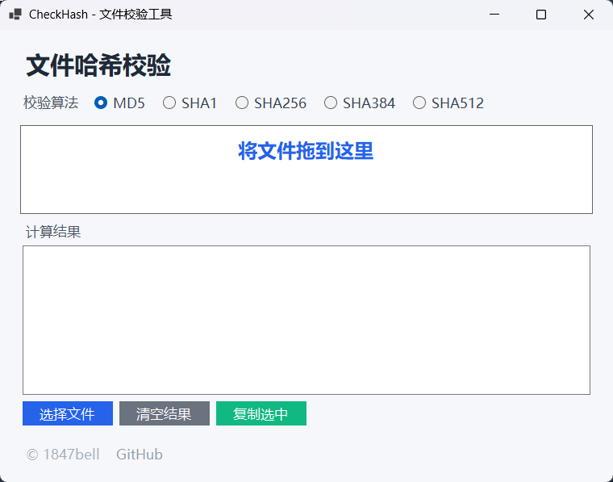

# CheckHash

一个简单的 Windows 文件哈希校验工具，使用 C# 和 Windows Forms 编写。



## 功能

- 窗口始终置顶
- 支持一次拖入多个文件，也可以通过文件选择对话框添加
- 支持 MD5、SHA1、SHA256、SHA384、SHA512
- 结果按 `文件名 => 哈希值` 逐行显示，可多选复制
- 发布为自包含单文件 EXE，无需安装 .NET 运行时

## 构建

```powershell
dotnet build CheckHash.csproj --configuration Release
dotnet publish CheckHash.csproj --configuration Release --self-contained true --runtime win-x64 -p:PublishSingleFile=true -p:IncludeNativeLibrariesForSelfExtract=true --output publish-single
```

## 下载

发布版本和源码请访问 [GitHub 仓库](https://github.com/1847bell/HashChecker)。
